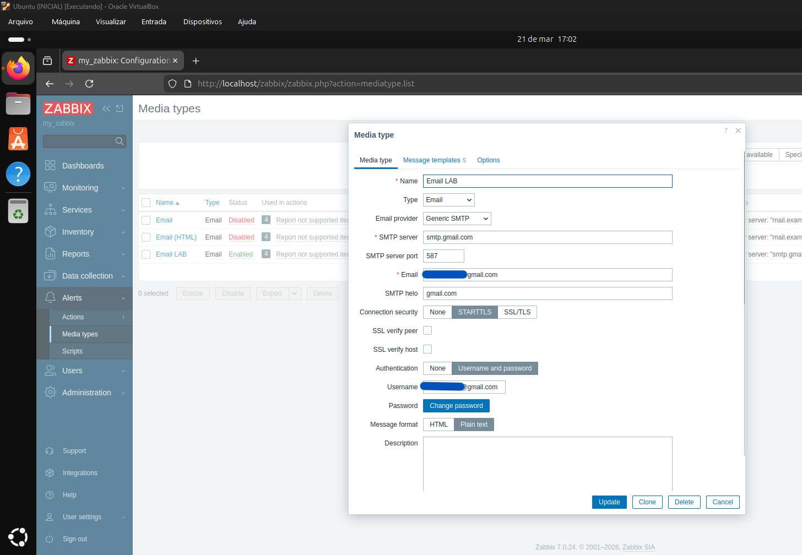
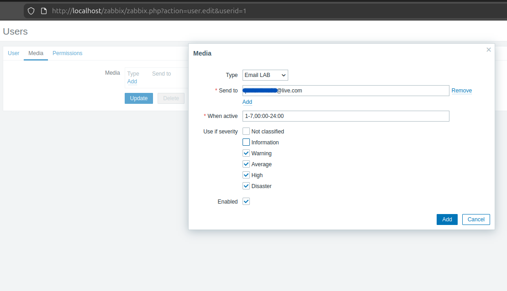
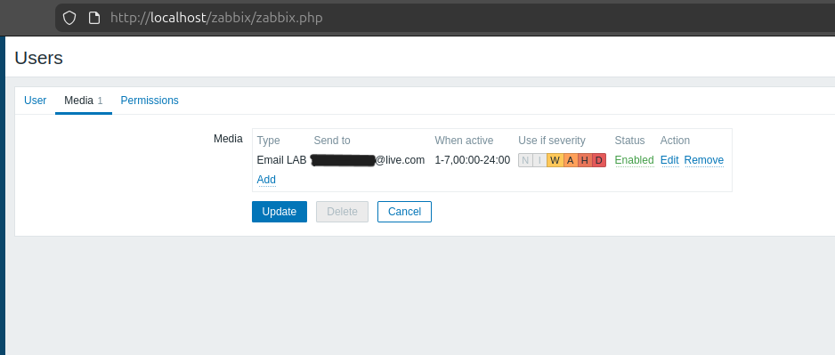
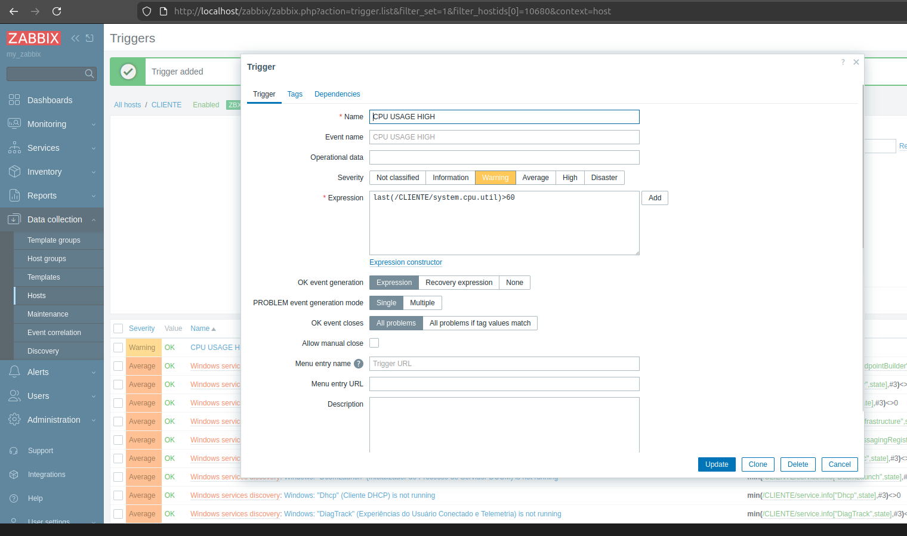
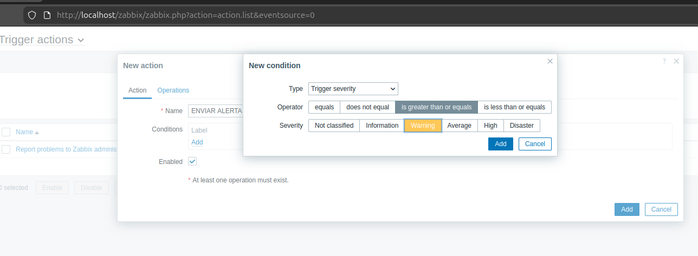
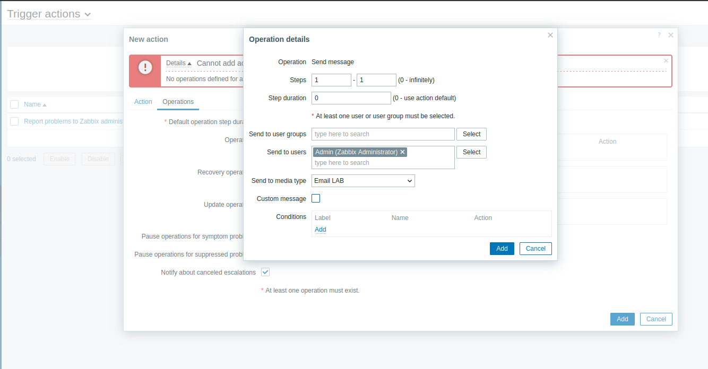
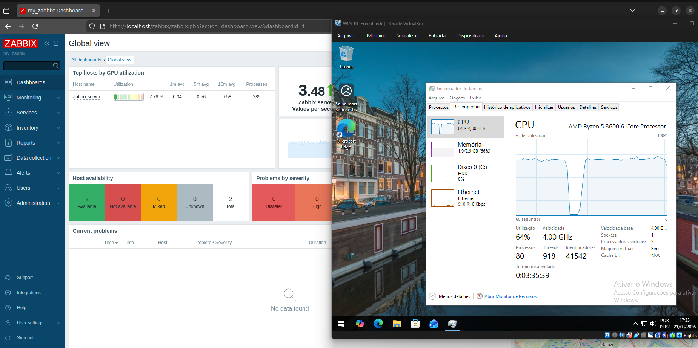
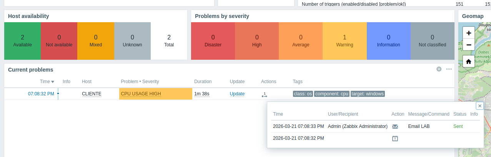
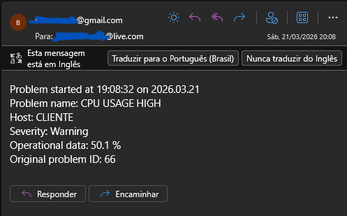

# 🧪 Zabbix EMAIL Alert

Laboratório configurando alerta de email após atingir métricas de trigger

## 📌 Objetivo
Desenvolver experiência prática em:

* Configuração de análise de métricas e configuração de alertas por EMAIL

## ☁️ Infraestrutura

* Máquina Virtual Linux (Ubuntu)
* Máquina Virtual Windows 10 (Cliente)

## 🚀 Etapas do projeto

### 1. Criação de MEDIA TYPE

Em Alerts e Media Types iremos configurar um tipo novo de Media para EMAIL, onde devemos configurar com os dados do servidor de email a ser usado para envio.

### 2. Configuração de tipos de Alertas

Após criar o Media Type, devemos configurar o usuário que vai receber o EMAIL com o alerta, o tempo de monitoramento e qual nível de severidade gerará o ALERTA

### 3. Configuração de Trigger e Métrica Analisada

Agora, devemos criar o gatilho de fato, que iria gerar o ALERTA no Zabbix Server, nesse caso, a análise será de consumo elevado de CPU e a severidade do ALERTA

### 4. Forçando o Alerta

Para disparar o Trigger e gerar o Alerta, na máquina virtual Windows 10 forcei a utilização da CPU para acima de 60%

### 5. Análisando o Alerta na dashboard

Assim, recebemos o alerta na dashboard do Zabbix Server, com o nome do HOST, grau de severidade, duração e ações tomadas

### 6. EMAIL com ALERTA recebido

Se tudo foi configurado correntamente, um email deverá ser recebido na conta configurada anteriormente, lembrando que a mensagem de composição pode ser personalizada

